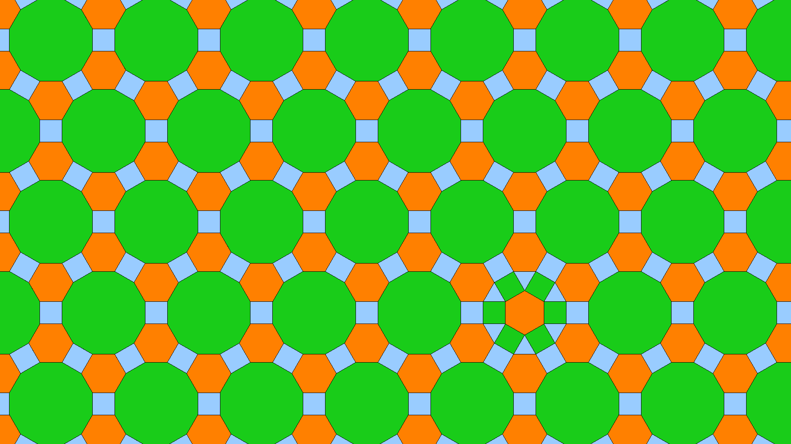

# A tiling app

A desktop app to create tilings using convex regular polygons.




# Table of contents

1. [Running](#running)
2. [Compiling](#compiling)
3. [Keybindings](#keybindings)
4. [Some math: Vertex tilings](#some-math-vertex-tilings)
5. [How the app determines if edges overlap](#how-the-app-determines-if-edges-overlap)
6. [Linux dependencies](#Linux-dependencies)

## Running

On linux, run:

```bash
./release/main
```

To run on windows, checkout branch `windows` and build using Visual Studio.

## Compiling

This project uses CMake. On linux, run:

```bash
cd release
cmake .. -D CMAKE_BUILD_TYPE=Release
cmake --build .
./main
```

To compile on windows, checkout branch `windows` and build using Visual Studio.

## Keybindings

**`Del` removes all the polygons.**

Move the edge cursor by pressing `Tab` or `Shift+Tab`.

Add a polygon on the edge cursor by pressing keys `3` to `9` (keys on the numpad also work).
Keys `0` to `2` create polygons with 10 to 12 sides.
Pressing `Shift` adds 10 sides to the polygon (so pressing `Shift` and `0` creates a polygon with 20 sides),
but only on Linux.

`Backspace` removes the last polygon.
Note that this won't work if the last polygon filled a blank (ie if all of its edges overlap with already existing ones).

Mouse movements move the camera.

Use `+` and `-` on the numpad to zoom in and out.

## Some math: Vertex tilings

You can surround a point with regular convex polygons only if their interior angles sum up to 360° or $2\pi$ radians.

For instance let's consider squares (with interior angles of 90° or $\pi/2$ radians). $4 \times \pi/2 = 2\pi$, so 4 squares form a *vertex tiling*.

There's a simple formula that allows to compute the interior angle of a regular n-gon. Intuitively, at each vertex, the n-gon has to be "closed" by some amount by straying away from the *straight line*. These $n$ "closing" angles will sum up to $2\pi$. Therefore, the interior angle of an n-gon in radians is:

$$\pi - \frac{2\pi}{n} = \frac{(n-2)\pi}{n}$$

An interesting fact to know when making tilings is that there are only 21 possible **vertex tilings** shown on the picture below.


Note that all vertex tilings can't tile the plane. Namely, it's impossible to use 42-gons, 24-gons, 20-gons, 18-gons, 15-gons, 10-gons or 5-gons (pentagons) to tile the plane. It's only possible to tile the plane using triangles, squares, hexagons, octogons and dodecagons (or 12-gons).

## How the app determines if edges overlap

This app uses a very crude method to determine whether edges overlap : it checks that the distance between both pairs of vertices is smaller than 1e-3 (edges have a length of 0.2). Using a smaller threshold would mean that the first non-recognized overlap happens sooner.

I didn't encounter a situation where the system mistakenly says there's an overlap: however such a situation might exist.

## Linux dependencies

Non-exhaustive list:
```
cmake build-essential libgl1-mesa-dev libglfw3-dev libglm-dev
```